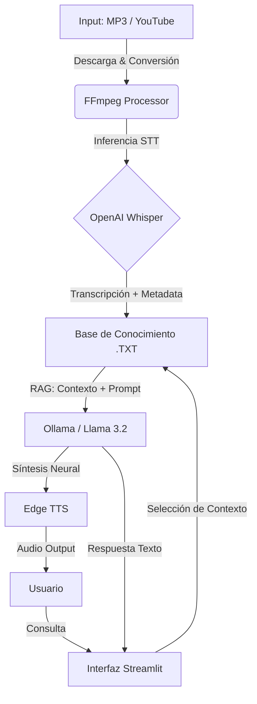

# 🧶 Quipu AI: Sistema RAG Multimodal Local


**Quipu AI** es una plataforma de ingeniería de software diseñada para la gestión del conocimiento auditivo. Implementa una arquitectura **RAG (Retrieval-Augmented Generation)** ejecutada 100% *On-Premise* (local), garantizando privacidad total.

El sistema transforma datos no estructurados (audio/video) en conocimiento consultable, integrando modelos de vanguardia como **Whisper** (STT), **Llama 3.2** (LLM) y **Edge-TTS**.

---

## Arquitectura del Sistema

El flujo de datos sigue un pipeline ETL (Extract, Transform, Load) seguido de inferencia generativa:



---

## Funcionalidades Clave

### 1. Núcleo RAG (Retrieval-Augmented Generation)

* **Ingesta Multifuente:** Soporta archivos locales (`.mp3`, `.wav`) y enlaces directos de YouTube (vía `yt-dlp`).
* **Memoria Selectiva:** Sistema de filtrado dinámico que permite al usuario activar/desactivar documentos específicos del "cerebro" de la IA antes de realizar una consulta.

### 2. Interfaz Multimodal

* **Entrada:** Chat de texto.
* **Salida:** Texto enriquecido (Markdown) y Voz Neural de alta fidelidad.
* **Voces Regionales:** Soporte nativo para acentos de **Colombia** (`es-CO`), **Perú** (`es-PE`), **México** (`es-MX`) y **España** (`es-ES`).

### 3. Infraestructura Portable

* **Dockerizado:** Contenedor optimizado basado en Linux Debian (Python 3.11-slim) con FFmpeg preconfigurado.
* **Acceso Remoto:** Configuración lista para tunelización vía **Ngrok**, permitiendo acceso desde dispositivos móviles.

---

## Guía de Despliegue

### Opción A: Producción (Docker) - Recomendado

Despliegue agnóstico del sistema operativo.

1. **Prerrequisitos:** Docker Desktop + Ollama (`ollama serve` en el host).
2. **Build & Run:**
```bash
docker build -t quipu-ai .
# El flag -e OLLAMA_HOST conecta el contenedor con el LLM del anfitrión
docker run -p 8501:8501 -e OLLAMA_HOST=[http://host.docker.internal:11434](http://host.docker.internal:11434) quipu-ai

```


3. **Acceso:** `http://localhost:8501`

### Opción B: Desarrollo (Local Python)

Para editar código fuente.

1. **Instalar dependencias:**
```bash
pip install -r requerimientos.txt

```


2. **Ejecutar Suite:**
```bash
streamlit run web_app_master.py

```


---

## Herramientas CLI (Modo Avanzado)

El repositorio incluye scripts independientes para tareas por lotes (Batch Processing) sin usar la interfaz web:

| Script | Función | Comando |
| --- | --- | --- |
| `transcribir_pro.py` | Transcribe **todos** los audios de la carpeta actual y genera `.txt` con timestamps. Ideal para procesar 10+ archivos de golpe. | `python transcribir_pro.py` |
| `descargar_yt.py` | Descargador puro de audio YouTube (MP3 Alta Calidad) sin transcripción. | `python descargar_yt.py` |
| `tts_manager.py` | Módulo de pruebas para síntesis de voz y verificación de audio. | `python tts_manager.py` |

---

## Solución de Problemas (Troubleshooting)

**1. Error: `FFmpeg not found**`

* **Causa:** El sistema no puede procesar audio.
* **Solución:**
* *Windows:* `winget install Gyan.FFmpeg` y reinicia la terminal.
* *Docker:* Asegúrate de que el `Dockerfile` incluya `apt-get install -y ffmpeg`.


**2. Docker no conecta con Ollama**

* **Causa:** El contenedor no ve el `localhost` de tu PC.
* **Solución:** Usa siempre `-e OLLAMA_HOST=http://host.docker.internal:11434` al ejecutar el `docker run`.

**3. La transcripción es lenta**

* **Causa:** Whisper está usando la CPU.
* **Optimización:** En `web_app_master.py`, cambia `MODELO_WHISPER = "small"` a `"base"` o `"tiny"` para mayor velocidad (menor precisión).

---

Desarrollado como proyecto de Ingeniería de Sistemas para la gestión de conocimiento académico y empresarial.

#### Edrem
#### Dios, la Patria y Assembly